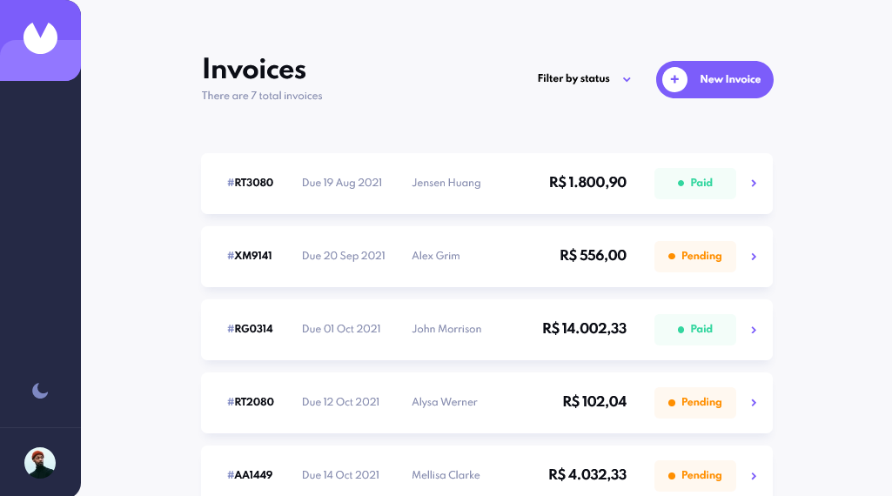
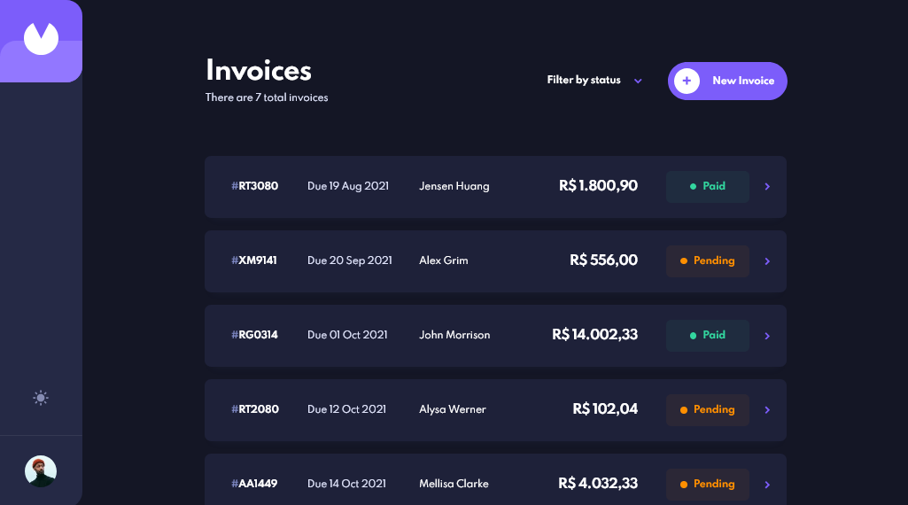

# Frontend Mentor - Invoice app

Esta é uma solução para o desafio [Invoice app Frontend Mentor](https://www.frontendmentor.io/challenges/invoice-app-i7KaLTQjl) Os desafios do Frontend Mentor ajudam você a melhorar suas habilidades de codificação ao construir projetos realistas.

## Índice

- [Visão geral](#visão-geral)
  - [O desafio](#o-desafio)
  - [Screenshot](#screenshot)
  - [Links](#links)
- [Processo](#processo)
  - [Construído com](#construído-com)
- [Autor](#autor)

## Visão geral

### O desafio

Os usuários devem ser capazes de:

- Ver o layout ideal para o aplicativo, dependendo do tamanho da tela do dispositivo
- Ver estados de foco para todos os elementos interativos na página
- Criar, ler, atualizar e excluir faturas
- Receber validações de formulário ao tentar criar / editar uma fatura
- Salvar rascunhos de faturas e marcar faturas pendentes como pagas
- Filtrar faturas por status (rascunho / pendente / pago)
- Alternar entre os modos claro e escuro
- **Bônus**: Acompanhe todas as alterações, mesmo depois de atualizar o navegador (`localStorage` pode ser usado para isso se você não estiver construindo um aplicativo full-stack)

### Screenshot

### Links

- URL do site ao vivo: [Link](https://invoice-app-ih0bu081o-julioalves-dev.vercel.app/)

## Processo

### Construído com

- React [Link](https://reactjs.org/)
- React Router [Link](https://reactrouter.com/)

## Autor

- Frontend Mentor - [@JulioAlves-Dev](https://www.frontendmentor.io/profile/JulioAlves-Dev)
- Twitter - [@JulioAlv35](https://twitter.com/JulioAlv35)
- Linkedin - [Julio Alves](https://www.linkedin.com/in/julio-alves-0119b01a6/)
